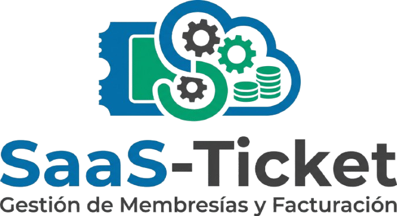

# 🚀 SaaS-Ticket

Sistema completo de gestión de membresías y facturación desarrollado con Node.js y MongoDB.

## 📸 Demo Visual



## 🛠️ Tecnologías

- Node.js
- Express
- MongoDB
- Mongoose
- JWT
- Bcrypt
- React (Frontend)

## 📦 Características

- Registro y login con roles (Admin / Usuario)
- Gestión de planes
- Suscripciones con fecha de expiración automática
- Dashboard administrativo
- Cálculo de ingresos mensuales
- Middleware de validación
- Arquitectura en capas (MVC + Services)

## 🧱 Arquitectura

backend/
controllers/
models/
routes/
middlewares/
services/

## ⚙️ Instalación

```bash
git clone https://github.com/tuusuario/saas-ticket.git
cd saas-ticket
npm install
npm run dev
